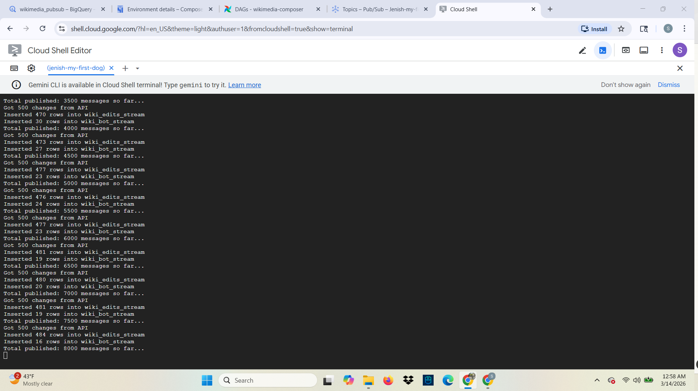
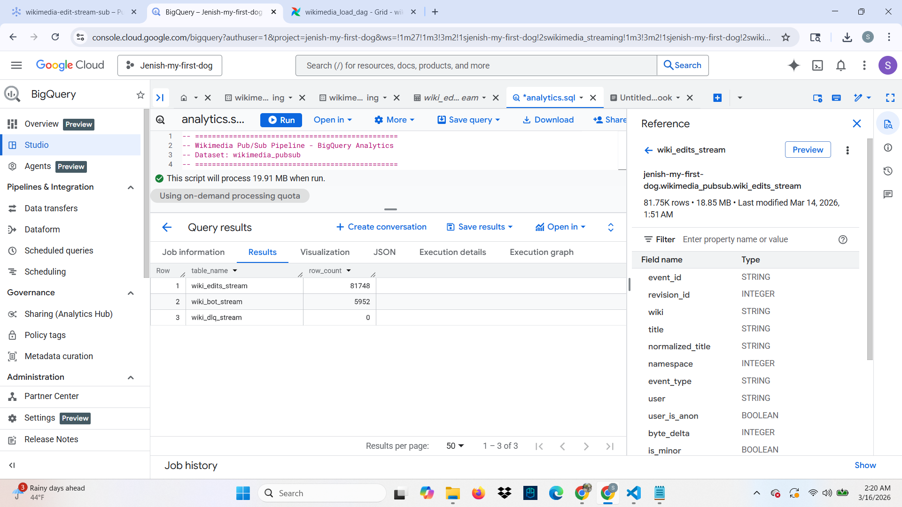

# Wikimedia Pub/Sub Pipeline


A real-time data pipeline that captures every Wikipedia edit event, routes them by type (human edits, bot edits, broken events), and delivers analytics-ready data into Google BigQuery via Google Cloud Pub/Sub.

---

## Pipeline Architecture

```
Wikimedia REST API (en.wikipedia.org)
            │
            ▼
  Publisher Script (Python)
  ┌─────────────────────────┐
  │  Fetch latest 500 edits │
  │  Validate each event    │
  │  Enrich with metadata   │
  │  Route by type          │
  └─────────────────────────┘
            │
     ┌──────┴──────┐──────────────┐
     ▼             ▼              ▼
wikimedia-    wikimedia-     wikimedia-
edit-stream   bot-stream     edit-dlq
(Pub/Sub)     (Pub/Sub)      (Pub/Sub)
     │             │              │
     ▼             ▼              ▼
wiki_edits_   wiki_bot_      wiki_dlq_
stream        stream         stream
(BigQuery)    (BigQuery)     (BigQuery)
```

---

## Tech Stack

| Tool | Purpose |
|---|---|
| Python 3 | Publisher script |
| Google Cloud Pub/Sub | Message queue (3 topics) |
| Google BigQuery | Data warehouse (3 tables) |
| Wikipedia REST API | Real-time edit data source |

---

## Real Engineering Challenges Solved

| Challenge | Solution |
|---|---|
| Bot traffic pollutes analytics | Route bot edits to separate topic + table |
| Missing/malformed events | Dead Letter Queue (DLQ) topic + table |
| Anonymous vs registered editors | `user_is_anon` flag via `userid == 0` check |
| Large byte changes (vandalism) | `byte_delta` field enables vandalism detection |
| GCP blocks Wikimedia SSE stream | Use Wikipedia REST API (not blocked) |

---

## BigQuery Tables

### `wiki_edits_stream` — Human Edits
- 81,748+ rows of real Wikipedia human edit events
- Fields: `event_id`, `title`, `user`, `byte_delta`, `is_minor`, `comment`, `event_timestamp` and more

### `wiki_bot_stream` — Bot Edits
- 5,952+ rows of bot edit events
- Same schema as human edits — enables bot vs human comparison

### `wiki_dlq_stream` — Dead Letter Queue
- Captures malformed or invalid events
- Fields: `raw_payload`, `error`, `ingested_at`
- 0 errors recorded — pipeline is clean ✅

---

## Repository Structure

```
wikimedia-pubsub-pipeline/
├── publisher/
│   └── wikimedia_publisher.py     # Main publisher script
├── schema/
│   ├── wiki_edits_schema.json     # BigQuery schema for human edits
│   ├── wiki_bot_edits_schema.json # BigQuery schema for bot edits
│   └── wiki_dlq_schema.json       # BigQuery schema for DLQ
├── sql/
│   └── analytics.sql              # 10 analytics queries
├── docs/
│   └── *.png                      # Demo screenshots
├── requirements.txt
└── README.md
```

---

## Screenshots

### Publisher Running — Real-time Messages


### Row Counts — All 3 Tables


### Top 20 Most Edited Articles


### Largest Edits — Vandalism Detection


---

## How to Run

### Prerequisites
- Google Cloud project with Pub/Sub and BigQuery enabled
- Python 3.8+
- GCP credentials configured (`gcloud auth application-default login`)

### Setup

**1. Create Pub/Sub topics:**
```bash
gcloud pubsub topics create wikimedia-edit-stream
gcloud pubsub topics create wikimedia-bot-stream
gcloud pubsub topics create wikimedia-edit-dlq
```

**2. Create BigQuery dataset and tables:**
```bash
bq mk --dataset your-project:wikimedia_pubsub
bq mk --table your-project:wikimedia_pubsub.wiki_edits_stream schema/wiki_edits_schema.json
bq mk --table your-project:wikimedia_pubsub.wiki_bot_stream schema/wiki_bot_edits_schema.json
bq mk --table your-project:wikimedia_pubsub.wiki_dlq_stream schema/wiki_dlq_schema.json
```

**3. Install dependencies:**
```bash
pip install -r requirements.txt
```

**4. Run the publisher:**
```bash
python3 publisher/wikimedia_publisher.py
```

The publisher polls the Wikipedia API every 30 seconds and continuously streams events into Pub/Sub and BigQuery.

---

## Analytics Queries

The `sql/analytics.sql` file contains 10 production-grade queries:

| # | Query | Purpose |
|---|---|---|
| 1 | Row counts | Monitor pipeline health |
| 2 | Top 20 most edited articles | Trending content detection |
| 3 | Bot vs human ratio | Traffic analysis |
| 4 | Most active human editors | Editor behavior analysis |
| 5 | Most active bots | Bot activity monitoring |
| 6 | Anonymous vs registered editors | User segmentation |
| 7 | Edit volume by hour (UTC) | Peak traffic analysis |
| 8 | Minor vs major edits | Edit classification |
| 9 | Largest edits by byte delta | Vandalism detection |
| 10 | Namespace breakdown | Content category analysis |

---

## Key Design Decisions

**Why Pub/Sub over direct BigQuery insert?**
Pub/Sub acts as a buffer between the publisher and BigQuery — if BigQuery is temporarily unavailable, messages are retained in the topic and delivered when it recovers. This decoupling is a core production pattern.

**Why separate topics for bots vs humans?**
Mixing bot and human edits in the same topic makes it impossible to apply different processing logic downstream. Separate topics allow independent scaling, filtering, and monitoring per traffic type.

**Why a Dead Letter Queue?**
Any event that fails validation (missing title, user, or timestamp) goes to the DLQ instead of being silently dropped. This enables monitoring and reprocessing of failed events — a critical requirement in production pipelines.

**Why Wikipedia REST API instead of SSE EventStreams?**
Wikimedia blocks Google Cloud IP ranges from their SSE EventStreams endpoint. In production this would run on a non-GCP server or use a proxy. The REST API delivers the same data and is not restricted.
